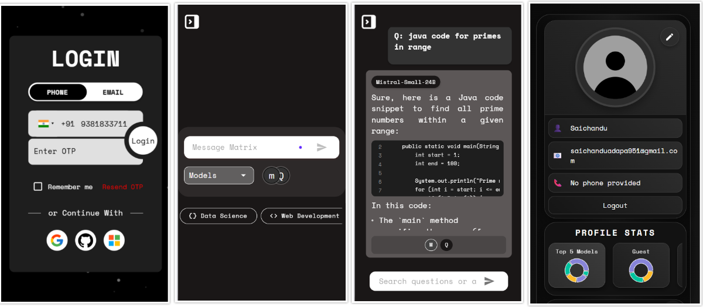

# 🚀 Matrix AI Platform

**Matrix AI Platform** is a next-generation web application that empowers users to interact with multiple state-of-the-art AI models through a single, unified interface. Designed for seamless user experience, robust data management, and real-time AI engagement, Matrix AI Platform is the ideal solution for students, professionals, and AI enthusiasts.

Developed using the **MERN Stack** (with PostgreSQL for data storage), this platform features multi-model chat, secure authentication, profile management, trending technology insights, and a modern, responsive UI built with Material UI. The project reflects best practices in full-stack development and is built for scalability and extensibility.

---

## 🌐 Live Demo

**🔗 [View the Live Project](http://210.212.210.86:7002/)**

---

## 🛠️ Tech Stack

- **Frontend:** `React.js`, `Material UI`, `HTML5`, `CSS3`, `JavaScript`
- **Backend:** `Node.js`, `Express.js`
- **Database:** `PostgreSQL`
- **AI Integration:** Together AI, OpenAI, Google Gemini, Anthropic Claude, Meta Llama, Bert
- **Authentication:** JWT, OAuth (Google, GitHub, Microsoft)
- **Visualization:** Mermaid.js for diagrams and charts

---

## 📸 Project Preview – Section by Section

### 🏠 Landing Page

A visually engaging landing page introducing the platform, its capabilities, and the latest in AI technology.

---

### 🤖 Multi-Model Chat

Interact with leading AI models (ChatGPT, Gemini, Claude, Llama, Bert, and Together AI) in real time. Compare responses, visualize data, and experience seamless AI conversations.

---

### 🔐 Authentication

Secure login and registration, including social login options (Google, GitHub, Microsoft). Ensures user data privacy and robust access control.

---

### 👤 Profile

Personalized user profiles with stats, chat history, and account management features. Users can view and manage their activity and preferences.

---

### 📈 Trending Technologies

Stay updated with the latest trends in AI and technology. Explore curated insights and featured innovations.

---

### 📝 Chat History

Access and review your previous conversations with different AI models. Track your learning and engagement over time.

---

## 📱 Responsive & Modern UI

- Fully responsive for desktop and mobile
- Smooth animations and transitions
- Uses Font Awesome icons and Google Fonts

---

## 🏆 Key Highlights

- 🔹 **Unified AI Access:** Chat with multiple AI models from a single platform, including Together AI.
- 🔹 **Material UI:** Modern, responsive, and accessible design using Material UI components.
- 🔹 **Secure Authentication:** Social login and robust user management.
- 🔹 **Profile & Stats:** Personalized dashboards and usage analytics.
- 🔹 **Real-Time Visualization:** Render diagrams and charts within chat.
- 🔹 **Trending Tech:** Discover the latest in AI and technology.
- 🔹 **Fully Responsive:** Optimized for mobile, tablet, and desktop.
- 🔹 **Scalable & Modular:** Easily extend with new models or features.
- 🔹 **PostgreSQL Database:** Reliable, scalable, and secure data storage.

---

This is a live project built using MERN stack with full authentication, real-time features, and a clean UI.

> 📌 The source code is private.  
> If you're interested in the code for collaboration, hiring, or learning, please contact me:

📧 saichanduadapa951@gmail.com  
📱 LinkedIn: [Saichandu Adapa](https://www.linkedin.com/in/saichandu-adapa-143b41254/)

---
### 🔐 Why is the code private?
This is an original project built with weeks of work and real-time functionality.  
To protect it from unauthorized use, the code is not publicly available.

